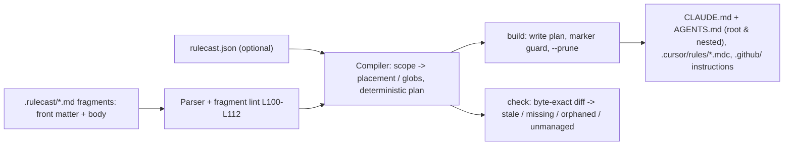

# rulecast

[English](README.md) | [中文](README.zh.md) | [日本語](README.ja.md)

[](LICENSE)   [](CONTRIBUTING.md)

**オープンソースの AI コーディングルール・コンパイラ — パスでスコープされたフラグメント一式から CLAUDE.md、AGENTS.md、Cursor ルール、Copilot 指示を生成。一方向のファイルコピーではなく、lint と CI ドリフト検査を備える。**


```bash
# not yet on npm — install from a checkout of this repository
npm install && npm run build && npm pack
npm install -g ./rulecast-0.1.0.tgz
```

## なぜ rulecast？

いまや多言語のチームはどこも、4 つの AI ツールのために乖離していく 4 つのルールファイルを抱えている。こちらに CLAUDE.md、あちらに AGENTS.md、独自 front matter 付きの `.cursor/rules/*.mdc`、そして `.github/` 配下の Copilot 指示 — 同じ規約が 4 方言に分かれ、「ちょっと直すだけ」のたびに離れていく。既存の同期ツールはこれをコピー問題として扱う：ルールファイルを丸ごと、各ツールの置き場所へ一方向にミラーするだけだ。rulecast はこれを*コンパイル*問題として扱う。信頼できる唯一のソースはパスでスコープされた小さなフラグメント群（`scope: packages/web/**`）で、各フラグメントは各ツールがネイティブに持つスコープ機構へとコンパイルされる — 配置で効くツールにはネストした CLAUDE.md/AGENTS.md、Cursor には `globs:`、Copilot には `applyTo:`、配置では正直に表現できない glob には明示的な「適用範囲」注記を添える。コンパイルは決定的かつバイト単位で正確なので、`rulecast check` は本物の CI ゲートになる：どの生成ファイルが手編集されたか、削除されたフラグメントがどの孤児ファイルを残したかを把握し、自分が生成していない手書きの CLAUDE.md の上書きは拒否する。13 個の安定ルールを持つフラグメント linter は、ルールが静かに「どこにも適用されない」事態を招くスコープの打ち間違いも捕まえる。

| 能力 | rulecast | rulesync | Ruler | コピペ / シンボリックリンク |
|---|---|---|---|---|
| ソースモデル | パスでスコープされたフラグメント | ツール別ルールファイルの変換 | 中央ファイルの連結 | 4 ファイルそのもの |
| スコープ → ツール固有機構（ネスト CLAUDE.md、`globs:`、`applyTo:`） | あり | 部分的（形式ごとの素通し） | なし — 全ツール同一の塊 | 手作業 |
| CI ドリフト検査（`check`、exit 1） | あり | なし — 再生成して祈る | なし | なし |
| 安定コード付きルールソース linter | あり（13 ルール） | なし | なし | なし |
| 手書きファイルの上書き拒否 | あり（マーカー + `--force`） | なし — 上書きする | なし — 上書きする | 対象外 |
| 孤児ファイルの検出と掃除 | あり | 部分的 | なし | なし |
| ランタイム依存 | 0 | 二桁 | 二桁 | 対象外 |

<sub>比較は各プロジェクトの公開ドキュメントと npm メタデータ（2026-07）に基づく。訂正は issue で歓迎。</sub>

## 特徴

- **パスでスコープされたフラグメントが唯一のソース** — 各フラグメントは `scope` glob、`targets` リスト、`order` を持ち、ツールの 4 方言はあくまでコンパイル産物で、直接編集しない。
- **スコープは各ツールが実際に持つ機構へ写像される** — `packages/web/**` は*ネストした* `packages/web/CLAUDE.md` と `AGENTS.md`、`globs:` 付き Cursor `.mdc`、`applyTo:` 付き Copilot `.instructions.md` になる。`**/*.sql` のような接尾 glob は Cursor/Copilot ではネイティブのまま、配置しかない場所では「… にマッチするファイルに適用」という可視の注記になる — 情報が黙って落ちることはない。
- **CI のためのドリフトゲート** — `rulecast check` はメモリ内で再コンパイルしてバイト単位で比較し、**stale**、**missing**、**orphaned**、**unmanaged** を修復コマンド付きで報告して exit 1。`--format json` の形は安定している。
- **ルールソースそのものの linter** — 13 個の安定コード（L100–L112）が具体的なヒント付きで発火：壊れた front matter、不正な glob、slug 重複、存在しないスコープディレクトリ、対象がすべて無効化されたフラグメント。
- **成果物を壊さない** — 生成ファイルは必ずマーカーコメントを持つ。`build` は `--force` なしでは無マーカーのファイルを上書きせず、孤児ファイルは `--prune` 時のみ削除する。
- **ランタイム依存ゼロ、完全オフライン** — 必要なのは Node.js だけ。パース、glob マッチ、合成、差分はすべてリポジトリ内実装で、ツールがソケットを開くことはない。

## クイックスタート

インストール：

```bash
# not yet on npm — install from a checkout of this repository
npm install && npm run build && npm pack
npm install -g ./rulecast-0.1.0.tgz
```

同梱の例を試す — TypeScript の web パッケージと Go の API サービスを持つ monorepo で、`.rulecast/` に 5 つのフラグメントがある：

```bash
cp -r examples/polyglot /tmp/polyglot && cd /tmp/polyglot
rulecast list
rulecast build
```

出力（実際の実行を記録）：

```text
FRAGMENT        SCOPE            PLACEMENT            TARGETS                       ORDER
00-project      (repo-wide)      root                 claude,agents,cursor,copilot  10
api-go          services/api/**  nested:services/api  claude,agents,cursor,copilot  20
claude-review   (repo-wide)      root                 claude                        90
sql-style       **/*.sql         root+note            claude,agents,cursor,copilot  30
web-typescript  packages/web/**  nested:packages/web  claude,agents,cursor,copilot  20

wrote      CLAUDE.md  (3 fragments)
wrote      packages/web/CLAUDE.md  (1 fragment)
wrote      services/api/CLAUDE.md  (1 fragment)
wrote      AGENTS.md  (2 fragments)
wrote      packages/web/AGENTS.md  (1 fragment)
wrote      services/api/AGENTS.md  (1 fragment)
wrote      .cursor/rules/00-project.mdc  (1 fragment)
wrote      .cursor/rules/api-go.mdc  (1 fragment)
wrote      .cursor/rules/sql-style.mdc  (1 fragment)
wrote      .cursor/rules/web-typescript.mdc  (1 fragment)
wrote      .github/copilot-instructions.md  (1 fragment)
wrote      .github/instructions/api-go.instructions.md  (1 fragment)
wrote      .github/instructions/sql-style.instructions.md  (1 fragment)
wrote      .github/instructions/web-typescript.instructions.md  (1 fragment)
built 14 files for 4 targets from 5 fragments: 14 written, 0 unchanged
```

続いてドリフトゲートを CI に組み込む — 生成ファイルへの手編集も、リビルドなしのフラグメント削除も、パイプラインを失敗させる（実際の実行を記録）：

```bash
echo "quick tweak" >> CLAUDE.md && rulecast check
```

```text
stale  CLAUDE.md  (content differs from the compiled fragments — run `rulecast build`)
check: FAIL — 1 problem across 14 planned files
```

終了コードは 1。`rulecast build` で同期が戻り、`rulecast init` は新規リポジトリの雛形を作る。フラグメント形式 — front matter キー、glob 構文、スコープ写像の全表、13 個の lint ルール — は [docs/fragment-format.md](docs/fragment-format.md) に仕様があり、さらなるシナリオは [examples/](examples/README.md) にある。

## コマンドとフラグ

`rulecast init | build | check | lint | list`。いずれも `-C/--dir` でリポジトリを指定でき、`init` 以外は `--format text|json` で出力形式も選べる。

| フラグ | 既定値 | 効果 |
|---|---|---|
| `-C, --dir PATH` | カレントディレクトリ | 操作対象のリポジトリルート |
| `--format text\|json`（init 以外） | `text` | 出力形式。JSON の形は CI 向けに安定 |
| `--force`（build） | オフ | rulecast マーカーのないファイルを置き換える |
| `--prune`（build） | オフ | 孤児となった生成ファイルを削除する |
| `--strict`（lint、check） | オフ | 警告でも失敗させる（exit 1） |
| `-q, --quiet` | オフ | ファイルごとの行を抑制。要約の数値は完全なまま |

終了コード：`0` クリーン、`1` 検出あり（lint エラー、ドリフト）、`2` 使い方・設定エラー — CI は「ルールがドリフトした」と「呼び出しが壊れている」を区別できる。設定は任意の `rulecast.json`（`source` ディレクトリ、有効な `targets`）。なければフラグメントは `.rulecast/` に置かれ、4 ターゲット全部が有効になる。

## 何がどこに生成されるか

| フラグメントのスコープ | claude / agents | cursor | copilot |
|---|---|---|---|
| なし（リポジトリ全体） | ルート `CLAUDE.md` / `AGENTS.md` のセクション | `.cursor/rules/<slug>.mdc`、`alwaysApply: true` | `.github/copilot-instructions.md` のセクション |
| `dir/**` | ネストした `dir/CLAUDE.md` / `dir/AGENTS.md` | `globs: dir/**` 付き `.mdc` | `.github/instructions/<slug>.instructions.md`、`applyTo` |
| その他の glob | ルートのセクション + 「… にマッチするファイルに適用」注記 | その glob 付き `.mdc` | その glob 付き `.instructions.md` |

## アーキテクチャ



## ロードマップ

- [x] claude/agents/cursor/copilot 向けフラグメントコンパイラ、スコープから方言への写像、ドリフト検査、13 ルールの linter、孤児掃除、JSON 出力、init/list CLI（v0.1.0）
- [ ] ターゲット追加：Windsurf ルール、Zed `.rules`、Aider 規約 — いずれも 3 形態のスコープ写像をドキュメント付きで
- [ ] `rulecast import`：既存の CLAUDE.md / .mdc ツリーからフラグメントを逆生成
- [ ] フラグメントの include とターゲット別本文オーバーライド（まれなツール固有の言い回し向け）
- [ ] ウォッチモード（`build --watch`）で編集しながらビルド

全リストは [open issues](https://github.com/JaydenCJ/rulecast/issues) を参照。

## コントリビュート

貢献を歓迎する。`npm install && npm run build` でビルドし、`npm test`（95 テスト）と `bash scripts/smoke.sh`（`SMOKE OK` を出力すること）を実行 — このリポジトリは CI を持たず、上記の主張はすべてローカル実行で検証されている。[CONTRIBUTING.md](CONTRIBUTING.md) を読み、[good first issue](https://github.com/JaydenCJ/rulecast/issues?q=is%3Aissue+is%3Aopen+label%3A%22good+first+issue%22) を選ぶか、[discussion](https://github.com/JaydenCJ/rulecast/discussions) を始めてほしい。

## ライセンス

[MIT](LICENSE)
