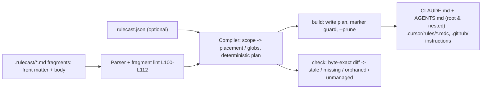

# rulecast

[English](README.md) | [中文](README.zh.md) | [日本語](README.ja.md)

[](LICENSE)   [](CONTRIBUTING.md)

**An open-source compiler for AI coding rules — one set of path-scoped fragments becomes CLAUDE.md, AGENTS.md, Cursor rules and Copilot instructions, with a lint pass and a CI drift check instead of one-way file copying.**


```bash
# not yet on npm — install from a checkout of this repository
npm install && npm run build && npm pack
npm install -g ./rulecast-0.1.0.tgz
```

## Why rulecast?

Every polyglot team now maintains four diverging rule files for four AI tools: a CLAUDE.md here, an AGENTS.md there, `.cursor/rules/*.mdc` with their own front matter, Copilot instructions under `.github/` — same conventions, four dialects, drifting apart with every "quick edit". Existing syncers treat this as a copying problem: take whole rule files and mirror them into each tool's location, once, in one direction. rulecast treats it as a *compilation* problem. The source of truth is a set of small, path-scoped fragments (`scope: packages/web/**`), and each fragment is compiled into whatever scoping mechanism each tool natively has — nested CLAUDE.md/AGENTS.md files for placement-scoped tools, `globs:` for Cursor, `applyTo:` for Copilot, and an explicit "applies to" note when no placement can express a glob honestly. Because compilation is deterministic and byte-exact, `rulecast check` becomes a real CI gate: it knows when a generated file was hand-edited, when a deleted fragment left orphans behind, and it refuses to clobber a hand-written CLAUDE.md it never generated. A fragment linter with 13 stable rules catches the scope typo that would otherwise apply your rules to nowhere.

| Capability | rulecast | rulesync | Ruler | copy-paste / symlinks |
|---|---|---|---|---|
| Source model | path-scoped fragments | per-tool rule files, converted | concatenated central files | the four files themselves |
| Scope → tool-native mechanism (nested CLAUDE.md, `globs:`, `applyTo:`) | yes | partial (per-format passthrough) | no — one blob for all tools | manual |
| CI drift check (`check`, exit 1) | yes | no — regenerate and hope | no | no |
| Rule-source linter with stable codes | yes (13 rules) | no | no | no |
| Refuses to clobber hand-written files | yes (marker + `--force`) | no — overwrites | no — overwrites | n/a |
| Orphan detection and pruning | yes | partial | no | no |
| Runtime dependencies | 0 | double-digit | double-digit | n/a |

<sub>Comparison against each project's public documentation and npm metadata, 2026-07. Corrections welcome via issues.</sub>

## Features

- **Path-scoped fragments as the single source** — each fragment carries a `scope` glob, a `targets` list and an `order`; the tools' four dialects are compiled outputs, never edited directly.
- **Scopes map to what each tool actually supports** — `packages/web/**` becomes a *nested* `packages/web/CLAUDE.md` and `AGENTS.md`, a Cursor `.mdc` with `globs:`, and a Copilot `.instructions.md` with `applyTo:`; a suffix glob like `**/*.sql` stays native for Cursor/Copilot and appears as a visible "Applies to files matching …" note where only placement exists — information is never silently dropped.
- **A drift gate built for CI** — `rulecast check` recompiles in memory and diffs byte-exactly, reporting **stale**, **missing**, **orphaned** and **unmanaged** files with the fix command, exit 1; `--format json` has a stable shape.
- **A linter for the rule source itself** — 13 stable codes (L100–L112) with a concrete hint each: broken front matter, invalid globs, duplicate slugs, scope directories that don't exist, fragments whose every target is disabled.
- **Never destroys your work** — every generated file carries a marker comment; `build` refuses to overwrite unmarked files without `--force`, and deletes orphans only under `--prune`.
- **Zero runtime dependencies, fully offline** — Node.js is the only requirement; parsing, glob matching, composing and diffing are all in-repo, and the tool never opens a socket.

## Quickstart

Install:

```bash
# not yet on npm — install from a checkout of this repository
npm install && npm run build && npm pack
npm install -g ./rulecast-0.1.0.tgz
```

Try the bundled example — a monorepo with a TypeScript web package and a Go API service, and five fragments in `.rulecast/`:

```bash
cp -r examples/polyglot /tmp/polyglot && cd /tmp/polyglot
rulecast list
rulecast build
```

Output (real captured run):

```text
FRAGMENT        SCOPE            PLACEMENT            TARGETS                       ORDER
00-project      (repo-wide)      root                 claude,agents,cursor,copilot  10
api-go          services/api/**  nested:services/api  claude,agents,cursor,copilot  20
claude-review   (repo-wide)      root                 claude                        90
sql-style       **/*.sql         root+note            claude,agents,cursor,copilot  30
web-typescript  packages/web/**  nested:packages/web  claude,agents,cursor,copilot  20

wrote      CLAUDE.md  (3 fragments)
wrote      packages/web/CLAUDE.md  (1 fragment)
wrote      services/api/CLAUDE.md  (1 fragment)
wrote      AGENTS.md  (2 fragments)
wrote      packages/web/AGENTS.md  (1 fragment)
wrote      services/api/AGENTS.md  (1 fragment)
wrote      .cursor/rules/00-project.mdc  (1 fragment)
wrote      .cursor/rules/api-go.mdc  (1 fragment)
wrote      .cursor/rules/sql-style.mdc  (1 fragment)
wrote      .cursor/rules/web-typescript.mdc  (1 fragment)
wrote      .github/copilot-instructions.md  (1 fragment)
wrote      .github/instructions/api-go.instructions.md  (1 fragment)
wrote      .github/instructions/sql-style.instructions.md  (1 fragment)
wrote      .github/instructions/web-typescript.instructions.md  (1 fragment)
built 14 files for 4 targets from 5 fragments: 14 written, 0 unchanged
```

Then wire the drift gate into CI — any hand edit to a generated file, or a fragment deleted without a rebuild, fails the pipeline (real captured run):

```bash
echo "quick tweak" >> CLAUDE.md && rulecast check
```

```text
stale  CLAUDE.md  (content differs from the compiled fragments — run `rulecast build`)
check: FAIL — 1 problem across 14 planned files
```

Exit code 1. `rulecast build` restores sync; `rulecast init` scaffolds a fresh repo. The fragment format — front matter keys, glob syntax, the full scope-mapping table and all 13 lint rules — is specified in [docs/fragment-format.md](docs/fragment-format.md), and more scenarios live in [examples/](examples/README.md).

## Commands and flags

`rulecast init | build | check | lint | list`, each accepting `-C/--dir` to point at a repo; every command except `init` also takes `--format text|json`.

| Flag | Default | Effect |
|---|---|---|
| `-C, --dir PATH` | current directory | repo root to operate in |
| `--format text\|json` (all but init) | `text` | output format; JSON shapes are stable for CI |
| `--force` (build) | off | replace files that lack the rulecast marker |
| `--prune` (build) | off | delete orphaned generated files |
| `--strict` (lint, check) | off | warnings also fail the run (exit 1) |
| `-q, --quiet` | off | per-file lines suppressed; summaries keep full counts |

Exit codes: `0` clean, `1` findings (lint errors, drift), `2` usage or config error — so CI can tell "your rules drifted" from "the invocation is broken". Configuration is an optional `rulecast.json` (`source` directory, enabled `targets`); with none present, fragments live in `.rulecast/` and all four targets are on.

## What gets generated where

| Fragment scope | claude / agents | cursor | copilot |
|---|---|---|---|
| none (repo-wide) | section in root `CLAUDE.md` / `AGENTS.md` | `.cursor/rules/<slug>.mdc`, `alwaysApply: true` | section in `.github/copilot-instructions.md` |
| `dir/**` | nested `dir/CLAUDE.md` / `dir/AGENTS.md` | `.mdc` with `globs: dir/**` | `.github/instructions/<slug>.instructions.md`, `applyTo` |
| any other glob | root section + "Applies to files matching …" note | `.mdc` with the glob | `.instructions.md` with the glob |

## Architecture



## Roadmap

- [x] Fragment compiler for claude/agents/cursor/copilot, scope-to-dialect mapping, drift check, 13-rule linter, orphan pruning, JSON output, init/list CLI (v0.1.0)
- [ ] More targets: Windsurf rules, Zed `.rules`, Aider conventions — each with a documented three-shape scope mapping
- [ ] `rulecast import` to bootstrap fragments from an existing CLAUDE.md / .mdc tree
- [ ] Fragment includes and per-target body overrides for the rare tool-specific phrasing
- [ ] Watch mode (`build --watch`) for live editing

See the [open issues](https://github.com/JaydenCJ/rulecast/issues) for the full list.

## Contributing

Contributions are welcome. Build with `npm install && npm run build`, then run `npm test` (95 tests) and `bash scripts/smoke.sh` (must print `SMOKE OK`) — this repository ships no CI, every claim above is verified by local runs. See [CONTRIBUTING.md](CONTRIBUTING.md), grab a [good first issue](https://github.com/JaydenCJ/rulecast/issues?q=is%3Aissue+is%3Aopen+label%3A%22good+first+issue%22), or start a [discussion](https://github.com/JaydenCJ/rulecast/discussions).

## License

[MIT](LICENSE)
