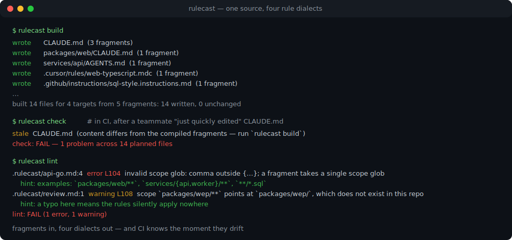
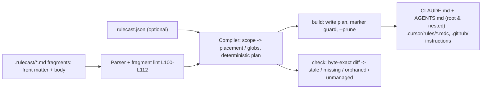

# rulecast

[English](README.md) | [中文](README.zh.md) | [日本語](README.ja.md)

[](LICENSE)   [](CONTRIBUTING.md)

**开源的 AI 编码规则编译器 —— 一套按路径分作用域的规则片段，编译出 CLAUDE.md、AGENTS.md、Cursor 规则和 Copilot 指令，自带 lint 与 CI 漂移检查，而不是单向文件复制。**



```bash
# not yet on npm — install from a checkout of this repository
npm install && npm run build && npm pack
npm install -g ./rulecast-0.1.0.tgz
```

## 为什么选 rulecast？

如今每个多语言团队都在为四个 AI 工具维护四份渐行渐远的规则文件：这边一个 CLAUDE.md，那边一个 AGENTS.md，带独立 front matter 的 `.cursor/rules/*.mdc`，还有 `.github/` 下的 Copilot 指令 —— 同一套约定、四种方言，每次"顺手一改"就又漂移一分。现有同步器把它当成复制问题：拿整份规则文件，单向镜像到每个工具的位置。rulecast 把它当成*编译*问题。唯一事实源是一组小巧的、按路径分作用域的片段（`scope: packages/web/**`），每个片段被编译成各工具原生支持的作用域机制 —— 靠文件位置生效的工具得到嵌套的 CLAUDE.md/AGENTS.md，Cursor 得到 `globs:`，Copilot 得到 `applyTo:`，遇到无法用位置诚实表达的 glob 则附上显式的"适用范围"注记。由于编译是确定性、逐字节精确的，`rulecast check` 成为一道真正的 CI 闸门：它知道哪个生成文件被手改过、哪个片段删掉后留下了孤儿文件，也拒绝覆盖它从未生成过的手写 CLAUDE.md。13 条稳定规则的片段 linter 还能抓住那种让规则悄悄"适用于无处"的作用域拼写错误。

| 能力 | rulecast | rulesync | Ruler | 复制粘贴 / 符号链接 |
|---|---|---|---|---|
| 源模型 | 按路径分作用域的片段 | 按工具的规则文件转换 | 集中文件直接拼接 | 那四个文件本身 |
| 作用域 → 工具原生机制（嵌套 CLAUDE.md、`globs:`、`applyTo:`） | 支持 | 部分（按格式透传） | 不支持 —— 所有工具同一坨 | 手工 |
| CI 漂移检查（`check`，exit 1） | 支持 | 无 —— 重新生成然后祈祷 | 无 | 无 |
| 带稳定编号的规则源 linter | 支持（13 条规则） | 无 | 无 | 无 |
| 拒绝覆盖手写文件 | 支持（标记 + `--force`） | 无 —— 直接覆盖 | 无 —— 直接覆盖 | 不适用 |
| 孤儿文件检测与清理 | 支持 | 部分 | 无 | 无 |
| 运行时依赖 | 0 | 两位数 | 两位数 | 不适用 |

<sub>对比依据各项目 2026-07 的公开文档与 npm 元数据。欢迎通过 issue 指正。</sub>

## 特性

- **按路径分作用域的片段是唯一源** —— 每个片段带 `scope` glob、`targets` 列表和 `order`；工具的四种方言只是编译产物，绝不直接编辑。
- **作用域映射到各工具真正支持的机制** —— `packages/web/**` 会变成*嵌套的* `packages/web/CLAUDE.md` 与 `AGENTS.md`、带 `globs:` 的 Cursor `.mdc`、带 `applyTo:` 的 Copilot `.instructions.md`；像 `**/*.sql` 这样的后缀 glob 在 Cursor/Copilot 保持原生，在只有位置机制的地方则以可见的"适用于匹配 … 的文件"注记呈现 —— 信息永不静默丢失。
- **为 CI 而生的漂移闸门** —— `rulecast check` 在内存中重新编译并逐字节比对，报告 **stale**、**missing**、**orphaned**、**unmanaged** 四类问题并附修复命令，exit 1；`--format json` 形状稳定。
- **面向规则源本身的 linter** —— 13 个稳定编号（L100–L112），每条附具体提示：损坏的 front matter、非法 glob、slug 重复、不存在的作用域目录、目标全被禁用的片段。
- **绝不毁坏你的成果** —— 每个生成文件都带标记注释；`build` 在没有 `--force` 时拒绝覆盖无标记文件，孤儿文件只在 `--prune` 下删除。
- **零运行时依赖，完全离线** —— 只需要 Node.js；解析、glob 匹配、编排与比对全部在仓库内实现，工具从不打开任何 socket。

## 快速上手

安装：

```bash
# not yet on npm — install from a checkout of this repository
npm install && npm run build && npm pack
npm install -g ./rulecast-0.1.0.tgz
```

试试内置示例 —— 一个含 TypeScript web 包与 Go API 服务的 monorepo，`.rulecast/` 下有五个片段：

```bash
cp -r examples/polyglot /tmp/polyglot && cd /tmp/polyglot
rulecast list
rulecast build
```

输出（真实运行捕获）：

```text
FRAGMENT        SCOPE            PLACEMENT            TARGETS                       ORDER
00-project      (repo-wide)      root                 claude,agents,cursor,copilot  10
api-go          services/api/**  nested:services/api  claude,agents,cursor,copilot  20
claude-review   (repo-wide)      root                 claude                        90
sql-style       **/*.sql         root+note            claude,agents,cursor,copilot  30
web-typescript  packages/web/**  nested:packages/web  claude,agents,cursor,copilot  20

wrote      CLAUDE.md  (3 fragments)
wrote      packages/web/CLAUDE.md  (1 fragment)
wrote      services/api/CLAUDE.md  (1 fragment)
wrote      AGENTS.md  (2 fragments)
wrote      packages/web/AGENTS.md  (1 fragment)
wrote      services/api/AGENTS.md  (1 fragment)
wrote      .cursor/rules/00-project.mdc  (1 fragment)
wrote      .cursor/rules/api-go.mdc  (1 fragment)
wrote      .cursor/rules/sql-style.mdc  (1 fragment)
wrote      .cursor/rules/web-typescript.mdc  (1 fragment)
wrote      .github/copilot-instructions.md  (1 fragment)
wrote      .github/instructions/api-go.instructions.md  (1 fragment)
wrote      .github/instructions/sql-style.instructions.md  (1 fragment)
wrote      .github/instructions/web-typescript.instructions.md  (1 fragment)
built 14 files for 4 targets from 5 fragments: 14 written, 0 unchanged
```

然后把漂移闸门接进 CI —— 任何对生成文件的手改，或删了片段却没重建，都会让流水线失败（真实运行捕获）：

```bash
echo "quick tweak" >> CLAUDE.md && rulecast check
```

```text
stale  CLAUDE.md  (content differs from the compiled fragments — run `rulecast build`)
check: FAIL — 1 problem across 14 planned files
```

退出码 1。`rulecast build` 恢复同步；`rulecast init` 为新仓库搭好脚手架。片段格式 —— front matter 键、glob 语法、完整的作用域映射表和全部 13 条 lint 规则 —— 详见 [docs/fragment-format.md](docs/fragment-format.md)，更多场景见 [examples/](examples/README.md)。

## 命令与选项

`rulecast init | build | check | lint | list`，均接受 `-C/--dir` 指定仓库；除 `init` 外还接受 `--format text|json` 指定输出。

| 选项 | 默认值 | 效果 |
|---|---|---|
| `-C, --dir PATH` | 当前目录 | 要操作的仓库根目录 |
| `--format text\|json`（init 之外） | `text` | 输出格式；JSON 形状对 CI 保持稳定 |
| `--force`（build） | 关 | 替换缺少 rulecast 标记的文件 |
| `--prune`（build） | 关 | 删除孤儿生成文件 |
| `--strict`（lint、check） | 关 | 警告也使运行失败（exit 1） |
| `-q, --quiet` | 关 | 隐藏逐文件行；摘要仍保留完整计数 |

退出码：`0` 干净，`1` 有发现（lint 错误、漂移），`2` 用法或配置错误 —— CI 能区分"你的规则漂移了"和"命令本身敲错了"。配置是可选的 `rulecast.json`（`source` 目录、启用的 `targets`）；没有它时，片段在 `.rulecast/` 下且四个目标全开。

## 什么内容生成到哪里

| 片段作用域 | claude / agents | cursor | copilot |
|---|---|---|---|
| 无（仓库全局） | 根 `CLAUDE.md` / `AGENTS.md` 中的小节 | `.cursor/rules/<slug>.mdc`，`alwaysApply: true` | `.github/copilot-instructions.md` 中的小节 |
| `dir/**` | 嵌套的 `dir/CLAUDE.md` / `dir/AGENTS.md` | 带 `globs: dir/**` 的 `.mdc` | `.github/instructions/<slug>.instructions.md`，`applyTo` |
| 其他任意 glob | 根文件小节 + "适用于匹配 … 的文件"注记 | 带该 glob 的 `.mdc` | 带该 glob 的 `.instructions.md` |

## 架构



## 路线图

- [x] 面向 claude/agents/cursor/copilot 的片段编译器、作用域到方言的映射、漂移检查、13 条规则的 linter、孤儿清理、JSON 输出、init/list CLI（v0.1.0）
- [ ] 更多目标：Windsurf 规则、Zed `.rules`、Aider 约定 —— 每个都带文档化的三形态作用域映射
- [ ] `rulecast import`：从现有 CLAUDE.md / .mdc 树反向引导出片段
- [ ] 片段 include 与按目标的正文覆写，应对罕见的工具专属措辞
- [ ] 监视模式（`build --watch`），边改边编

完整列表见 [open issues](https://github.com/JaydenCJ/rulecast/issues)。

## 参与贡献

欢迎贡献。先 `npm install && npm run build` 构建，再运行 `npm test`（95 个测试）和 `bash scripts/smoke.sh`（必须打印 `SMOKE OK`）—— 本仓库不带 CI，以上所有断言都由本地运行验证。参见 [CONTRIBUTING.md](CONTRIBUTING.md)，认领一个 [good first issue](https://github.com/JaydenCJ/rulecast/issues?q=is%3Aissue+is%3Aopen+label%3A%22good+first+issue%22)，或发起一场 [discussion](https://github.com/JaydenCJ/rulecast/discussions)。

## 许可证

[MIT](LICENSE)
